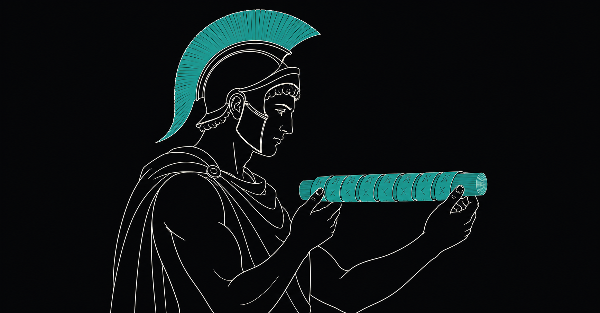

# SKYTALE

An end-to-end-encrypted messenger, delivered as an installable **PWA**, built
against **suspicionless mass surveillance** (the EU "Chat Control" / CSAR
proposal).

Named after the [scytale](https://en.wikipedia.org/wiki/Scytale), the Spartan
transposition cipher.

<p align="center">
  
</p>

<p align="center"><sub><i>Wind a strip of leather around a rod of exactly the right diameter and the scrambled letters line up into the message. Without the matching rod — the shared secret — it's just noise. The same idea, modern cryptography.</i></sub></p>

> **Status:** the cryptographic core (identity, X3DH, Double Ratchet, sealed
> sender, at-rest vault, multi-device identity + device linking) is implemented
> and tested. A newly linked device now receives your profile and contacts and is
> reliably reachable for your peers; bounded text history is bootstrapped, while
> historical attachments are deliberately not cloned yet. See
> [Status](#status) and the open issues.

## Principle

The server is a **dumb ciphertext mailbox**. It never sees plaintext. All
encryption and decryption happen exclusively on the device. The relay learns as
little as addressing a message physically requires — and, with sealed sender,
not even *who* sent it.

## Security model

Two independent encryption layers, plus a metadata-minimising transport.

### 1. At rest (on the device)

```
passphrase --Argon2id(salt, high memory cost)--> KEK   (non-extractable, RAM only)
KEK        --wrap / unwrap (AES-256-GCM)-------->  DEK  (non-extractable, random)
DEK        --AES-256-GCM (fresh 96-bit nonce + AAD)--> every record
```

The DEK is a **non-extractable `CryptoKey`**, so JavaScript cannot directly
export its raw bytes. This is not protection against hostile same-origin code:
an XSS in an unlocked app can use the key as a crypto oracle and read plaintext.
A wrong passphrase is detected by the failing GCM auth tag — no separate
verifier, nothing to brute-force offline beyond Argon2id itself.

### 2. Transport (end-to-end over the network)

- **X3DH** handshake to establish a shared secret from prekey bundles.
- **Double Ratchet** (Signal-style, over libsodium primitives — Ed25519 for
  signing, X25519 for key agreement) for **forward secrecy** and
  **post-compromise security**, tolerant of out-of-order delivery.
- **Sealed sender**: the relay routes to a recipient pseudonym without learning
  the sender. What remains is the irreducible residue any addressed transport
  leaks (which inbox, timing, size) — documented, not hidden.

### 3. Multi-device (identity, linking, revocation)

- A **master identity** (cross-signing key) anchors all of a user's devices; the
  master **private** key never leaves the primary device.
- **Device linking** pairs a new device via a **SAS** (7-emoji short
  authentication string) the human compares on both screens — the linking
  channel carries only public material until that human confirmation.
- Each of a peer's authorised devices gets its **own** X3DH + ratchet session
  (per-device fan-out). Invariant: a message key is used exactly once **per
  session** — ratchets are never shared across devices (no two-time pad).
- **Revocation** is a master-signed device list: a device absent from a newer
  list loses reachability. Peers stop fanning out to it.

The full threat model, including what is deliberately out of scope, lives in
**[SECURITY.md](SECURITY.md)** — the mechanism-by-mechanism breakdown, kept
current with the code.

## Stack

- **Frontend:** Vite + React 19 + TypeScript, installable PWA
- **Crypto:** libsodium (Ed25519, X25519) for the messaging layer; Argon2id
  (hash-wasm) + WebCrypto AES-256-GCM for the at-rest vault
- **Backend:** Cloudflare Worker + **Durable Object** (WebSocket relay,
  Hibernation API); content-free Web Push for wake-ups
- **Storage:** IndexedDB — ciphertext only

## Status

| Area | State |
| --- | --- |
| At-rest vault (Argon2id / KEK-DEK / AES-256-GCM) | ✅ |
| Identity (Ed25519 + X25519), safety number | ✅ |
| X3DH + Double Ratchet (FS + PCS, out-of-order) | ✅ |
| Relay + live chat (Worker + Durable Object) | ✅ |
| PWA hardening (CSP, update prompt, auto-lock, lazy-load) | ✅ |
| Sealed sender (sender metadata minimisation) | ✅ |
| Multi-device: master identity + cross-signed device certs | ✅ |
| Device linking (SAS), per-device sessions, revocation | ✅ |
| Self-sync of *sent* messages to your own devices | ✅ |
| **Link initial-sync**: profile + contacts + bounded text history land on a newly linked device | ✅ |
| Reliable inbound to a linked device (ack-driven device-list re-gossip) | ✅ |
| Link initial-sync: full chat **history** to a linked device | 🚧 [#1](https://github.com/PropagandaPand/SCYTALE/issues/1) |
| Device management (see / remove linked devices, device names) | 🚧 [#2](https://github.com/PropagandaPand/SCYTALE/issues/2) |
| Groups v3: owner roster, contactless key exchange, all-device fan-out, revocation | ✅ |

A newly linked device now pulls your profile, contact list and relay-confirmed,
chunked text history from the primary, so it is recognisably your account rather
than an empty shell. Historical attachments and legacy messages without a stable
message id are deliberately skipped; complete history transfer remains open.

## Development

```bash
npm install        # .npmrc sets ignore-scripts (skips miniflare's sharp build)
npm run dev        # Vite dev server (frontend only, no relay)
npm run build && npm run cf:dev   # Worker + Durable Object locally (incl. relay)
npm run deploy     # nur sauberer, exakt gepushter Branch: Preflight + Build + Worker-Deploy
npm run cf:lifecycle:show   # R2-Aufbewahrungsregeln read-only prüfen
npm run cf:lifecycle:apply  # getrennte, bewusst freizugebende Lifecycle-Änderung
```

`npm run deploy` verändert absichtlich keine R2-Lifecycle-Regeln. Die
Aufbewahrungs- und Löschpolicy wird getrennt geprüft und angewendet, damit ein
fehlgeschlagener Worker-Release niemals vorab die Datenlöschpolicy verändert.
`workers_dev` bleibt für den unterstützten `scytale.illogical.workers.dev`-Origin
aktiv.

Checks:

```bash
npx tsc --noEmit   # type-check
npm test           # node test suite (pure crypto + conversation layers)
```

The test suite bundles the transport-/storage-agnostic core with esbuild and
runs it under Node. Every security property has at least one assertion, and each
assertion ships with a **negative control** (fed a deliberately wrong input once,
so a green test can never be false confidence).

### Testing with two devices

1. `npm run build && npm run cf:dev`, then open two browser windows on the local
   Worker URL (or deploy and open on two devices). **Two devices need two
   separate storage origins** — two tabs in the same browser profile share one
   vault and are the *same* device.
2. Create a vault (your own passphrase) in each.
3. In window A: **"Share me (QR / link)"** → scan the QR, or send the link (one
   tap adds). Or paste the link/token under **"Add contact"**. Same in reverse.
4. One person writes first (becomes the X3DH initiator); the other replies. From
   there the Double Ratchet runs.

The contact bundle contains **only public keys** — the link may travel over any
channel, even an insecure one. Compare your **safety number** afterwards to rule
out a man-in-the-middle.

## Limits

- **Metadata:** the relay sees *which inbox, when, how big* — never content, and
  (with sealed sender) not the sender. Traffic analysis remains hard; full
  network-level unlinkability would need Tor/a mixnet.
- **Code delivery:** a PWA loads JS from a server, so a compromised server could
  serve backdoored code. Mitigated (not eliminated) by service-worker pinning of
  the installed app and reproducible builds.
- **Endpoint:** no encryption helps against a compromised device (malware,
  client-side scanning in the OS, physical access to an unlocked vault) — which
  is precisely the point of the objection to Chat Control.
- **Multi-device:** see [Status](#status) — bounded text history reaches a newly
  linked device, but historical attachments/legacy no-id messages do not. Group
  state, bounded text history and new group messages fan out to current member
  devices and the sender's linked devices.
- **Groups:** v3 uses authenticated pairwise X3DH/Double-Ratchet copies per
  authorised device, not MLS or one shared group key. A removed member keeps
  already received history; exclusion governs future fan-out once the owner's
  monotonic roster update has been processed. Safety-number comparison remains
  the independent check for identities introduced through a group owner.

---

*The user-facing app is multilingual: it defaults to the system language and can be
switched in Settings. Twelve languages are curated (de, en, es, fr, it, pt, nl, pl,
ru, uk, tr, zh); strings are wrapped incrementally, and anything not yet translated
falls back to the German source. Developer-facing content — code, comments, docs,
commits — is in English.*
